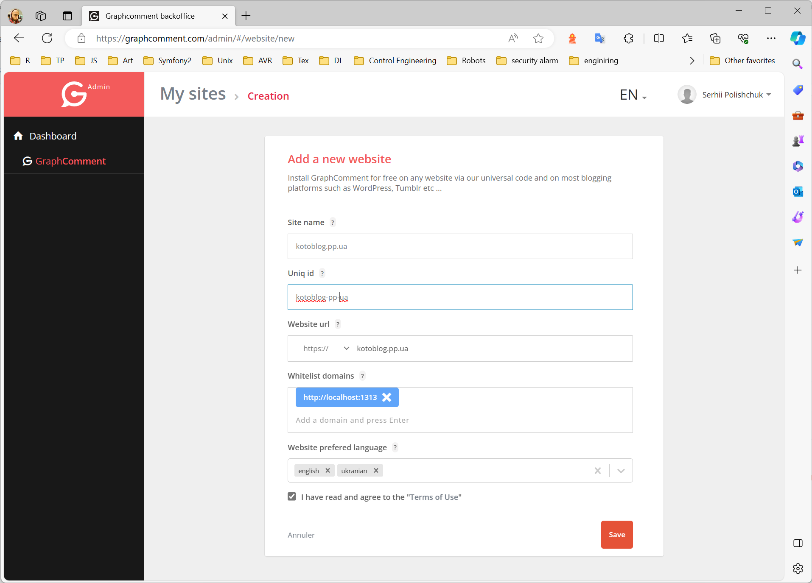
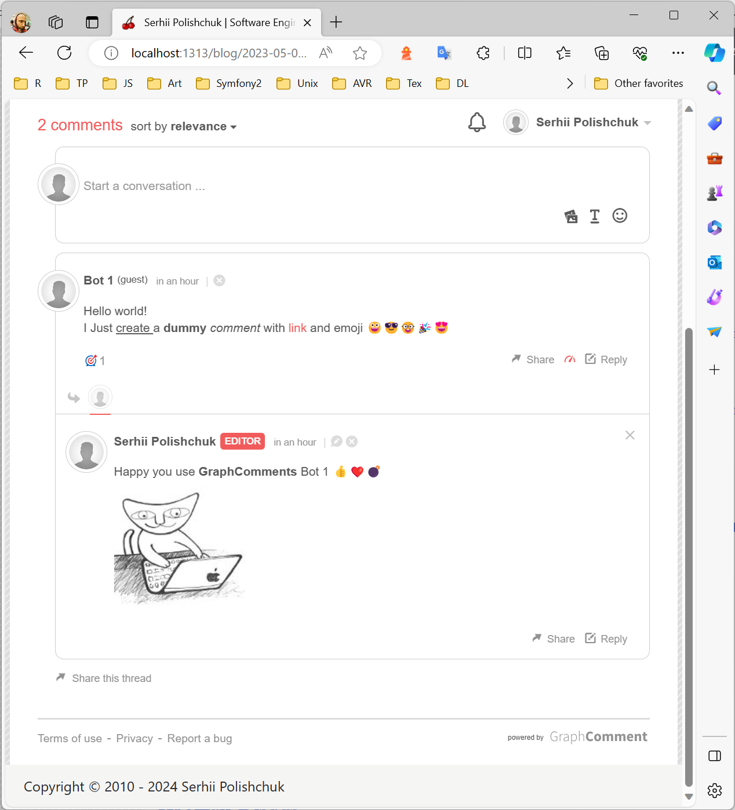
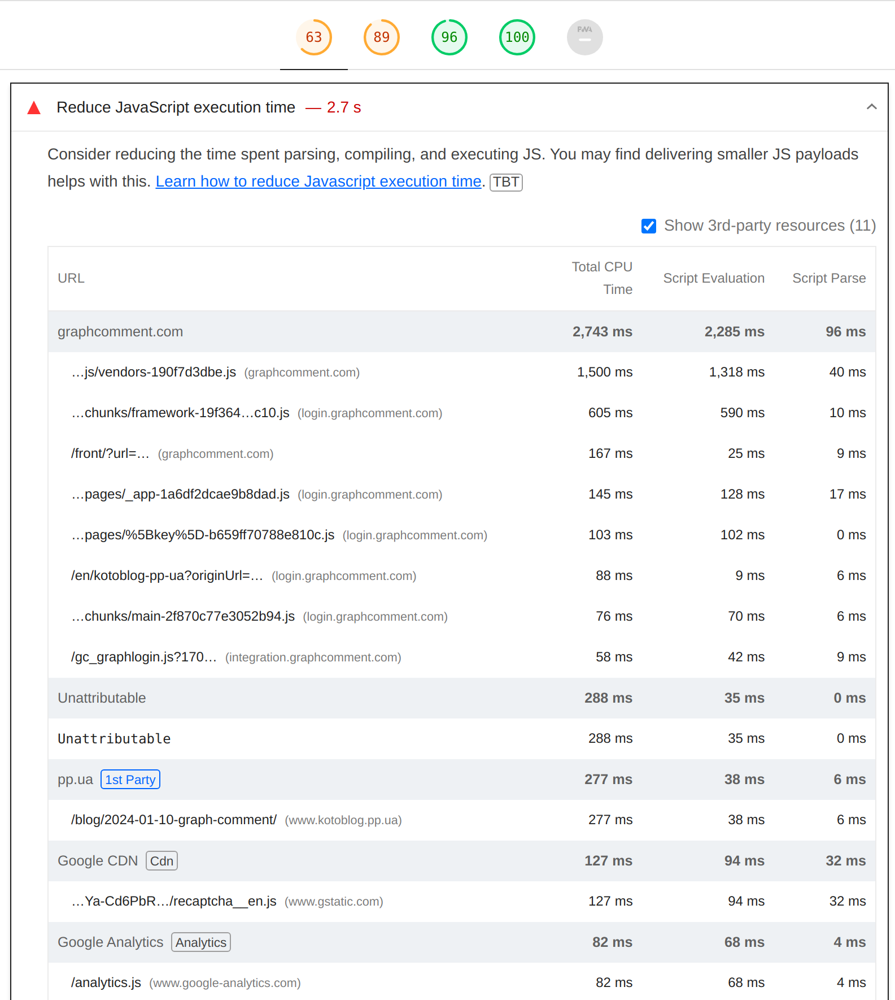

At my interview at Open Web I faced with the challenge of diagramming a comment storage and display system. 
Even I was rejected to the position, I learned a lot from this experience and
I think I start better understand the complexity of such solutions. 
While the specifics of the interview remain confidential under NDA, 
the lessons learned continue to resonate in my technical pursuits.

Researching the landscape, I discovered that **Disqus**, a major competitor of the **Open Web**. 
I used Disqus before when this blog was based on the **Symfony Framework**. 
Despite having utilized Disqus in the past, 
concerns over data privacy prompted me to forgot third-party solutions. 
Instead, I embarked on 
a [10-hour coding marathon](https://github.com/spolischook/kotoblog_v2/commit/d6e192eb31683d4ba8a1598fe61b1a060d67fe9e), 
leveraging Symfony components to engineer a custom comment system for my website – 
which I described in [this article](../bye-bye-disqus).

Fast forward to the present, where my tech blog underwent a transformation 
onto the **Hugo framework**. 
Eager to reinstate comments on my articles, 
I explored [alternatives](https://gohugo.io/content-management/comments/#alternatives) within the Hugo community. 
With around ten potential solutions at my fingertips, 
I randomly choose [Graph Comment](https://www.graphcomment.com) -
a decision that proved fruitful, taking less than an hour to integrate seamlessly.

I added my [custom shortcode](https://github.com/spolischook/kotoblog_v3/layouts\shortcodes\comments.html) with a few variables inside,
and [used in the page itself](https://github.com/spolischook/kotoblog_v3/content\blog\2024-01-10-graph-comment\index.md).  

### Conclusion

My experience with Hugo has been remarkably positive, particularly for public websites. Its versatility and robust features have provided an excellent foundation for my tech blog's transformation. The extensibility of Hugo allows for seamless integration of additional functionalities, making it a dynamic and scalable solution. Moreover, as I explored alternatives for comments within the market, it became evident that the landscape is rich with options. While Graph Comment proved to be a quick and effective choice for my needs, the maturity and refinement of longstanding services in the comments domain make it clear that there are numerous well-polished alternatives to suit diverse preferences and requirements.

### P.S.

Of course, there are the same issues with GraphComment as with Disqus.  
Next time I'll try https://giscus.app/ which declare:  
> No tracking, no ads, always free.


