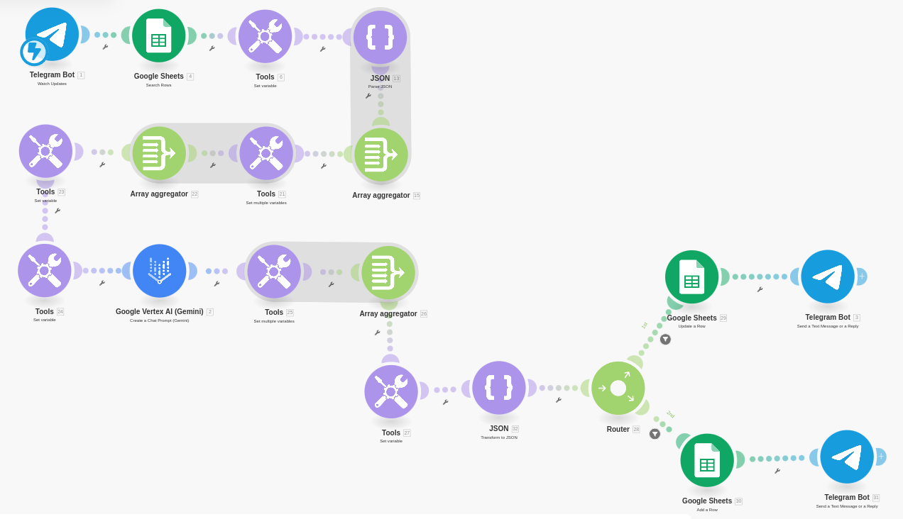
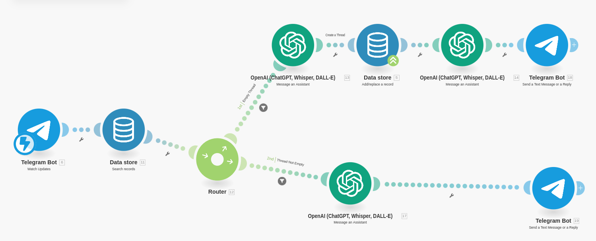

I have always dreamed of having a personal AI assistant that could help me with my daily tasks. 
Ideally, it should be capable of understanding not only text, but also images, voice, and video.

With the recent advances in AI, I finally have the opportunity to create such an assistant. 
I am particularly impressed by the fact that it is now possible to build one using no-code tools, 
making the process accessible and worth trying.

One major issue with current chat-based AI assistants 
is that they cannot securely store personal secrets, 
such as passwords or credit card information. 
My goal is to create an AI assistant that not only helps me with daily tasks, 
but also keeps my personal information safe.

I have explored platforms like n8n and Make.com—both are excellent. 
However, Make.com offers more flexible and affordable plans.

This time the goal was to create a Telegram bot powered by Google's Vertex AI Gemini models, 
capable of remembering conversation history for contextually relevant interactions.

### The Core Challenge: Managing Conversation State

A key difference compared to some other AI platforms 
(like OpenAI's Assistants API with its built-in Threads) 
is that the Vertex AI Gemini API is stateless. 
This fundamental aspect meant that the primary task 
within Make.com was to manually design and implement the logic for managing conversation memory. 
For each message, the scenario had to explicitly handle 
retrieving, updating, and saving the conversation history associated with the specific Telegram user.

### Storage Choice: Google Sheets

Due to potential concerns about the storage size limitations of Make.com's built-in Data Store, 
especially on lower-tier plans, Google Sheets was selected as the persistent storage mechanism. 
A simple structure was used, mapping the user's Telegram ChatID to a single cell 
containing the entire conversation history stored as a JSON text string (HistoryJSON).

### Implementation Journey & Hurdles in Make.com:

Building the state management visually in Make.com 
involved a relatively complex sequence of modules 
and required overcoming several specific technical hurdles related to data handling:

1. **History Retrieval/Storage**: This required using Google Sheets > Search Rows 
    to find the user's history based on ChatID. 
    A Router was necessary to differentiate between 
    updating an existing row (Update a Row) for returning users 
    and adding a new row (Add a Row) for first-time users.

2. **Data Formatting (JSON String <-> Make Array)**: 
    This proved to be the most intricate part.

    1. **Parsing**: 
    The JSON string from Sheets needed to be parsed into a Make array. 
    This involved using ifempty to provide a default [] string for new users, 
    feeding this text to JSON > Parse JSON, and then immediately using Flow Control > Array aggregator 
    to reconstruct a usable array variable. 
    Defining the correct Data Structure (an Array of Collections) 
    within Parse JSON was crucial and required 
    careful configuration, including debugging issues where 
    the module failed on valid input like "[]" or "[{\\"role\\":...}]".

    2. **Creating**: Saving the history back required the reverse: 
    converting the final Make array variable 
    (containing the full updated history) into a JSON string 
    using the JSON > Create JSON module before mapping it 
    to the Google Sheets modules. Direct mapping 
    resulted in incorrect text like [Collection], [Collection].

3. **Manipulating History Array**: Adding new user and model messages 
    to the history array required specific Make patterns. 
    Initial attempts using add(array; key; value; key; value) 
    or mapping the output of Create JSON directly failed, 
    appending strings instead of objects. The working solution involved:

    1. Using Tools > Set Multiple Variables to define the role and content 
        of the new message.

    2. Using Flow Control > Array aggregator to build 
        a single-item array containing the properly structured message object.

    3. Using Tools > Set Variable with the merge() function 
        to combine the existing history array and the new single-item message array. 
        This pattern was needed for both user and AI messages.

4. **AI Interaction**: Configuring the Google Vertex AI (Gemini) module itself 
    was relatively straightforward once the input data 
    (history_for_ai array, created using slice() for truncation) 
    was correctly prepared. 
    Initial setup required enabling the correct APIs 
    (Vertex AI, Cloud Resource Manager) and linking billing 
    in the dedicated GCP project, as well as re-authorizing 
    the Make connection to ensure sufficient OAuth scopes.

5. **Flow Control & Final Reply**: Because visually merging execution paths 
    after a router proved problematic in the UI (connections "bouncing"), 
    ensuring the final Telegram reply was sent 
    after the Google Sheet operation required duplicating 
    the Telegram Bot > Send a Text Message module at the end 
    of both the "Add Row" and "Update Row" branches.

### Comparison with OpenAI Assistants Example

The resulting Make.com scenario is functionally complete for text chat with history but is visually complex. This contrasts sharply with scenarios built using the OpenAI Assistants API. In that case:

- OpenAI manages the conversation state (history) internally via "Threads".

- Make.com only needs to manage the Thread ID, often stored simply using Data Store > Get a record / Add/replace a record mapping Chat ID to Thread ID.

- A single OpenAI > Message an Assistant module handles sending the message and implicitly uses the stored history associated with the Thread ID.

- The complexity of parsing, array manipulation, truncation, and JSON formatting is entirely abstracted away by the API, leading to a much leaner Make.com scenario.

### Conclusion

Building a stateful Gemini chatbot in Make.com that manually manages conversation history using external storage like Google Sheets is achievable. However, the process highlights the significant number of explicit steps, data transformations, and flow control modules required compared to using APIs that abstract state management. The visual complexity directly reflects these necessary manual operations. Expanding this scenario to handle multimodal inputs (images, voice) or complex role-based logic within Make.com would add further layers of branching and specialized modules.