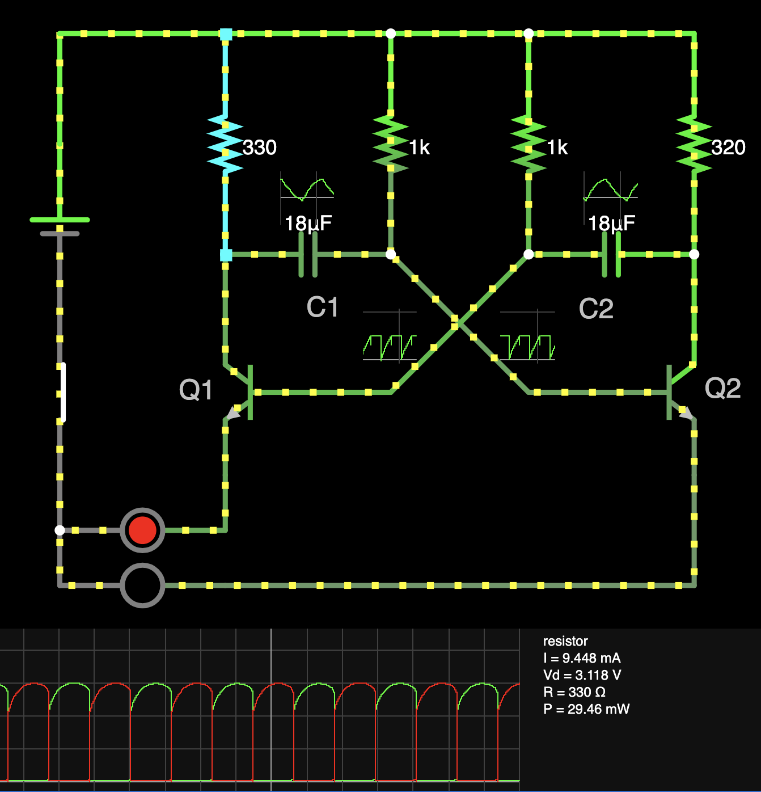

Ця схема — класичний астабільний мультивібратор, який працює як генератор прямокутних імпульсів. Два транзистори (Q1 і Q2) почергово відкриваються і закриваються, створюючи безперервне коливання. Це забезпечується через перехресне з’єднання конденсаторів (C1 і C2) з базами транзисторів: коли один транзистор відкривається, конденсатор заряджається й подає імпульс на закриття іншого транзистора.

Мені врешті-решт вдалося зробити проект з мікроелектроніки. 
Це проект для шкільного проекта мого сина.
Знається з приходом AI, і вирішенням проблеми з високими зарплатами у програмуванні, 
я зможу нарешті повернутися до того, що мені дійсно подобається.


<video width="640" height="480" controls loop muted playsinline preload="auto">
  <source src="./multivibrator.mp4" type="video/mp4">
  Your browser does not support the video tag.
</video>


[Link to the circuit simulator](https://www.falstad.com/circuit/circuitjs.html?ctz=CQAgjCAMB0l3BWEAOaAmZYCcB2BzkcBmLUhJBSECqhAUwFowwAoAd3DDRABZkQ0kfnyjsBQ3vwzD+kMdMkgiyHorkAnTtxHNuYHADYoSohvEzz4Q8bCRBLTQpEL9Rqrfublqkd6tulewBjLX9LV14oWHgwWXRbSCweAySiA300NC4ouAg5EL8Il2tVGHhIWPBoBB4cZEgcDHSiQVscHIrRDkLrPzQeKjkAFwECAQQjPombKIMEbCxBLARl-Ds4g2R5wwMeNGUcSFN2hJAAEzoAMwBDAFcAGyH5CSKxtGm5DmKjQSkPlhGv3GRl0wJmDDQ0AGWGQSQaux4yyIH3QQgGyBI2FMQjw4Dg5yud0eYlBEVB-UGLAAHuAVgJsvosPSkKowEYAMKsGlEfT0ogmdpZIysjloakoJBoAzuSA-Az8kUgACKXKUWCo7yZPGYAgM2nARiVYoG-Ow3CBmVUFJsaAA+u8DLbILbtXZbQgndAwLamPbbVxbUQWCaBI1LKYrQMbN6HU6XR53Z6eD6Y-7vUGQy13BglAg9NLjMh-Rg4667ZCPTBk767UWM0dwDxWTmyQWqDhi0XnWX7dVPd6a7aO0G2Xpsml+GylJsBASbg8hgx7nQzuBjINYKwAG4G8Ig7KDXi0ddRBBiPphvwRrqhNBh0HXz670nC2Qk1+hERyADOu6BU8fYwbnub86BYUdQiINJdygn45yJRdl1XPJ103d8lEgRVYJvADoIAmcnwfPDx0wnDxxnK8CPPFRp34K9SLkAB7cB+V2EBhUSLUoUEWo5nSOxERIDpOg1PF2JYIA)