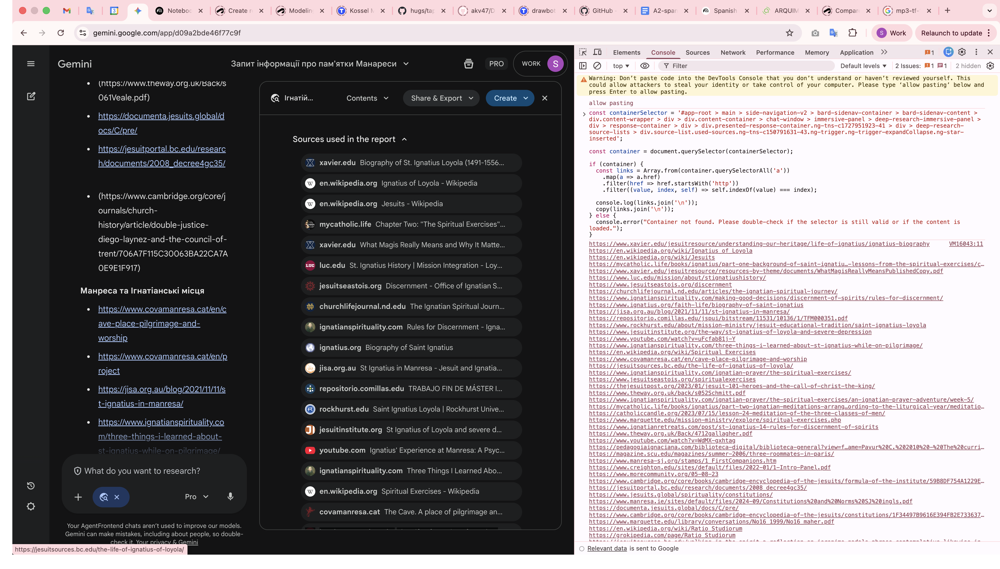
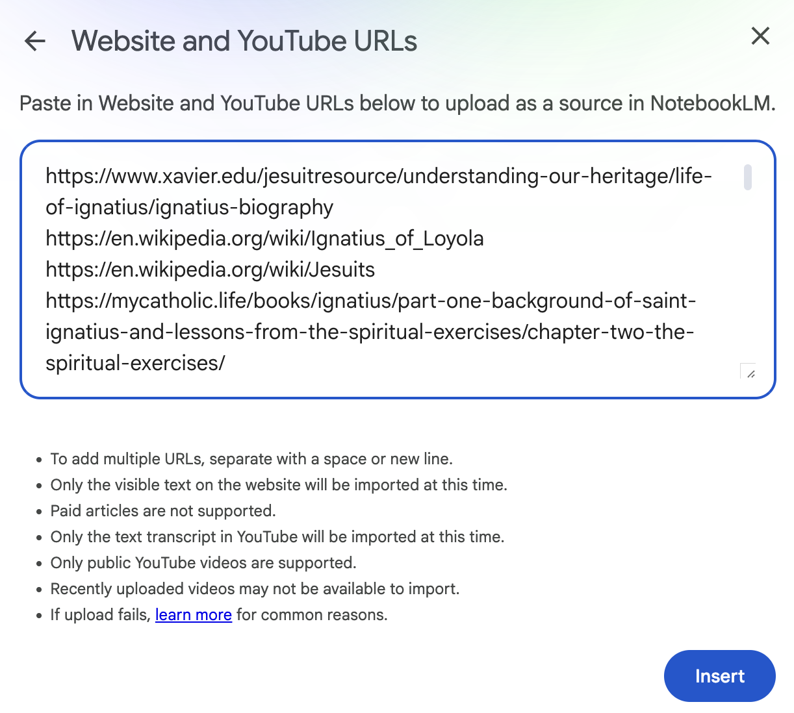

Я знайшов робочий варіант для створення аудіо подкасту про цікаві теми.

1. Запускаю DeepResearch на цікаву тему
2. По завершенню DeepResearch запускаю скрипт щоб зібрати всі знайдені джерела

```js
const containerSelector = '#app-root > main > <container-where-all-sources-are>';

const container = document.querySelector(containerSelector);

if (container) {
  const links = Array.from(container.querySelectorAll('a'))
    .map(a => a.href)
    .filter(href => href.startsWith('http'))
    .filter((value, index, self) => self.indexOf(value) === index);

  console.log(links.join('\n'));
  copy(links.join('\n'));
} else {
  console.error("Container not found. Please double-check if the selector is still valid or if the content is loaded.");
}
```



Отримані лінки додаю як джерела у NotebookLM і створюю аудіо подкаст.


