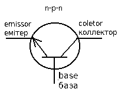

<!--more-->
Лише невеликий натиск на курок може вивільнити чималу кількіть енергії у вигляді пострілу.
Принцип роботи транзистора можна порівняти з пістолетом, та перш ніж ми зрозуміємо як це працює
давайте поглянемо на умовне позначення транзистора.

При натисканні кнопки - світлодіод загоряється. 
Це може здатися не надто захоплюючим проте це має велике значення для усіх великих і малих схем де є транзистори.

На схемі з транзистором присутні два електричні кола.
Перше між **Емітером** і **Коллектором**, інше між **Емітером** і **Базою**.
Назвемо **Емітер-Коллектор** коло *Вихідним* (OUTPUT), а **Емітер-База** - *Вхідним* (INPUT) відповідно.

Вихідне коло повністю замкнене проте світлодіод не загоряється поки ми не нажмемо кнопку і не замкнемо вхідне коло.
Невеликий струм у вхідному колі (одна батарея), вмикає вихідне коло з більшою потужністю (дві батареї), і світлодіод загоряється.



  <iframe src="https://www.falstad.com/circuit/circuitjs.html?cct=$+1+0.000005+10.20027730826997+50+5+50%0At+608+256+656+256+0+1+-9.870590449723535+0.11941294963734489+100%0A162+832+192+752+192+2+default-led+1+0+0+0.01%0Ar+880+224+880+304+0+680%0Av+704+336+752+336+0+0+40+5+0+0+0.5%0Av+784+336+832+336+0+0+40+5+0+0+0.5%0Ar+720+432+656+432+0+10000%0As+576+320+576+400+0+1+false%0Aw+656+240+656+192+0%0Aw+656+192+752+192+0%0Aw+832+192+880+192+0%0Aw+880+192+880+224+0%0Aw+880+304+880+336+0%0Aw+880+336+832+336+0%0Aw+720+432+768+432+0%0Aw+768+432+768+336+0%0Aw+784+336+768+336+0%0Aw+752+336+768+336+0%0Aw+704+336+656+336+0%0Aw+576+256+608+256+0%0Aw+576+400+576+432+0%0Aw+576+432+656+432+0%0Ap+576+304+656+304+1+0%0Aw+576+320+576+304+0%0Aw+576+304+576+256+0%0Aw+656+272+656+304+0%0Aw+656+304+656+336+0%0A"></iframe>


