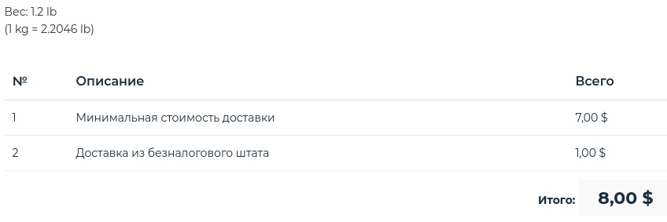

<!--more-->
На сайті Nvidia зовсім недавно з'явилася нова модель із серії Jetson-ів - Nano. 
З назви стає зрозуміло що це щось невелике проте так як вся серія призна до глибинного навчання (DL), то стало цікаво на що здатна ця крихітка.

Замовити Nano можна [на сайті Nvidia](https://www.nvidia.com/en-us/autonomous-machines/embedded-systems/jetson-nano/).
Є також [російськомовна версія](https://www.nvidia.com/ru-ru/autonomous-machines/embedded-systems/jetson-nano/) де можна прочитати про технічні характеристики.
Для доставки в Україну я скористався службою доставки [MEEST AMERICA Inc](https://my.meest.us/ua/index).
Доставка через Делавер (без податку США) обійшлась у 8 USD та приблизно 3 тижні.

Податок в Україні також сплачуватись не довелось - на данний момент посилки до 100 Євро не обкладаються податком.

### Характеристики та архітектура

Девайс складається з двох частин. Базова плата з чотирьох ядерним процесором ARM Cortex®-A57 і 4Гб ОЗУ на борту, 
має усі необхідні порти для підключення переферійних пристроїв - HDMI, Display Port, 4xUSB, gigabit ethernet, 
2 роз'єми жилення, GPIO і роз'єм для камери сумісний з Raspbery Pi. Взагалі то вся базова плата подібна до
популярного Raspberry Pi, от тільки bluetooth і wifi доведеться підключати окремо. 

Верхня плата з радіатором, яка вставлена в роз'єм та міцно прикручена гвинтами є основною відмінністю від вже
згаданої Raspberry Pi, і головним об'єктом досліджень. На ній розташований 128 ядерний GPU від Nvidia, Maxwell архітектури. 

Для живлення плати з GPU потрібно 10 Ватт потужності у стандартному режимі живлення. Роз'єм microUSB від 2А блока живлення може
надати таку потужність, проте в такому разі не вистачить на інші перефірійні пристрої й на роботу всієї системи в цілому, тому
система може підвисати і працювати не стабільно. Для цього на платі є barrel роз'єм, він дозволяє подати одразу 4А. 
Між barrel роз'ємом (J25) та роз'ємом камери (J13) розташований коннектор J48 на який слід встановити джампер задля переключення
живлення з microUSB (по замовчанню) на barrel роз'єм. Про це написано на самій платі - "ADD JUMBER TO DISABLE uUSD PWR". 

Для живлення я використав [БЖ Chieftec CDP-085ITX](http://www.chieftec.eu/en/psus/external-psu/cdp-085itx.html) +12В / 7.5А
та підстроєчний стабілізатор напруги:

### Початок роботи

Для початку знадобиться SD карта, мінімум 16 Гб. 
Краще одразу 32 Гб, бо 16 вистачить всього на пару днів експерементів - розпаковка моделей потребує додаткових МегаБайтів.
На карту буде одразу записано Ubuntu з усіма необхідними для роботи драйверами.
 Інструкція по запису імейджу на карту знаходиться на [оф сайті](https://developer.nvidia.com/embedded/learn/get-started-jetson-nano-devkit#write)
, єдине що скачати доволі об'ємний образ
в мене вийшло не з першого разу через нестабільний конект із сервером прийшлось докачувать через консоль:

    wget -c --retry-connrefused --tries=0 --timeout=5 https://developer.nvidia.com/embedded/dlc/jetson-nano-dev-kit-sd-card-image

Інструкція з установки на [оф сайті](https://developer.nvidia.com/embedded/learn/get-started-jetson-nano-devkit#write), проте вона мало чим відрізняється
від установки Raspbian, if you know what I mean ;)
Єдина можлива відмінність, що для запису я скористався графічною утилітою [balenaEtcher](https://www.balena.io/etcher/)(Linux, Win, Mac).
Для любителів консолі, все залишається незмінно - комманда `dd` сконвертує і запише образ на диск.

Після першої загрузки, та настройки робочого оточення треба скачати на встановити необхідні демо матеріали.
Інструкція та сам код знаходяться на [GitHub](https://github.com/dusty-nv/jetson-inference), короткий огляд демо матеріалів нижче.

### Привіт Світ (Hello World)

Документація розділена на дві умовні частини:
- Hello AI World - тут розглядається робота з вже натренерованими моделями
- Two Days to a Demo - тренування своїх власних моделей і робота з ними

Для другої частини знадобиться комп'ютер з відеокартою, або хмара, але на данний момент вони дуже дорогі.
Рекомендована сайтом [timdettmers.com](https://timdettmers.com/2019/04/03/which-gpu-for-deep-learning/) (General GPU Recommendations) відеокарта RTX 2070 
на 05.2019 коштує десь 700 USD. Тому я зосередився на першій частині, а другу залишив до часу коли зберу стипендії на відеокарту ;)

#### 1. Встановлення JetPack

[Перша частина](https://github.com/dusty-nv/jetson-inference/blob/master/docs/jetpack-setup-2.md) про встановлення JetPack, але т.я. я встяновив образ на SD карту одразу, то він уже є, тому окремо 
ставити його не треба. Але є ідея спробувати поставити Raspbian, щоб трохи зекономити ресурсів, і тоді вже спробувати поставити JetPack. Але це задача на далеке майбутнє, спрешу треба спробувати 
працювать з Jetson без X сервер взагалі.

#### 2. Готуємо код

Друга частина розказує про те як скачати та встановити код для роботи з Hello AI World. 
Спершу переконаємось що cmake встановлено:

    sudo apt-get install git cmake

Потім скачаємо код з GitHub репозиторію та ініціалізуємо сабмодулі:

    git clone https://github.com/dusty-nv/jetson-inference
    cd jetson-inference
    git submodule update --init

Під час запуску cmake, спеціальний скрипт (CMakePreBuild.sh) буде запущено перед інсталяцією, який встановить необхідні залежності.
Скрипт потребує прав супер користувача. Необхідні моделі будуть скачані з мережі.

    mkdir build
    cd build
    cmake ../

Тепер можна компілити код:

    make
    sudo make install

#### 3. Розпізнавання об'єктів (image recognition)

Існує багато типів нейронних мереж, які різняться за своїм призначенням.
Можна виділити такі типи як розпізнавання, локалізація та сегментація.

Для тренування нейромереж був створений популярний на данний час серві [ImageNet](http://www.image-net.org/).
ImageNet - це база данних аннотованих фотограій. Кожне фото може бути позначене одним або декількома тегами(іменниками).
Таким чином ImageNet є однією з найбільших сховищ яке використовують для тренування нейромереж.

Нейронка яка поставляється разом з *Jetson Nano* натренована розпізнавати [до 1000 різних об'єктів](https://github.com/dusty-nv/jetson-inference/blob/master/data/networks/ilsvrc12_synset_words.txt)
Консольна комманда `imagenet-console` здатна розпізнати натреновані об'єкти по фотографії. Команда приймає два аргументи - 
повний або відносний шлях до фотографії яку треба розпізнати а також шлях куди скаладати результат роботи.
На фотографії в результаті буде встановлено клас та відсоток впевненості.

Для початку переконаймося що ми у папці з скомпільованими програмами:
`cd ~/jetson-inference/build/aarch64/bin`

Далі запустимо программу розпізнавання:

`./imagenet-console path/to/input-image.jpg path/to/output-image.jpg`

Розпізнавання апельсину пройшло успішно:

